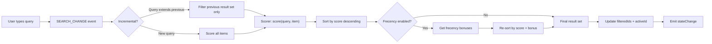
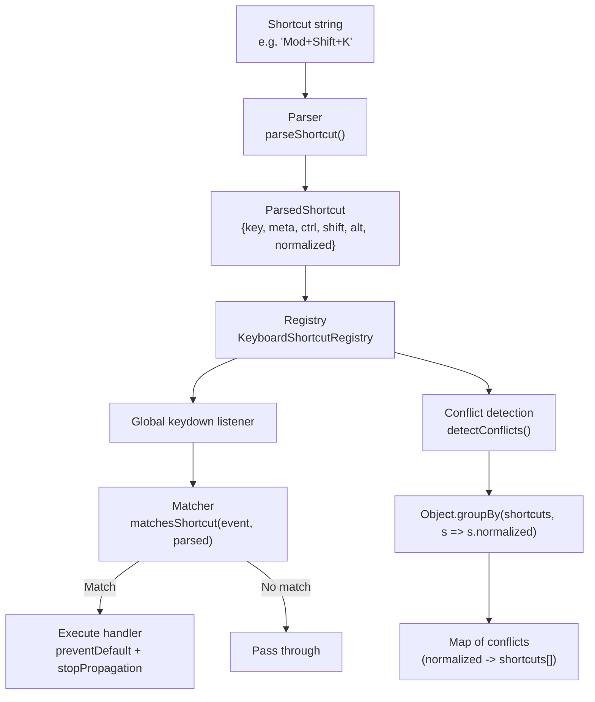
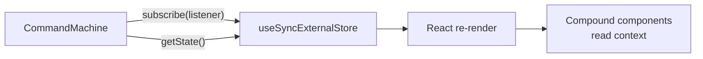
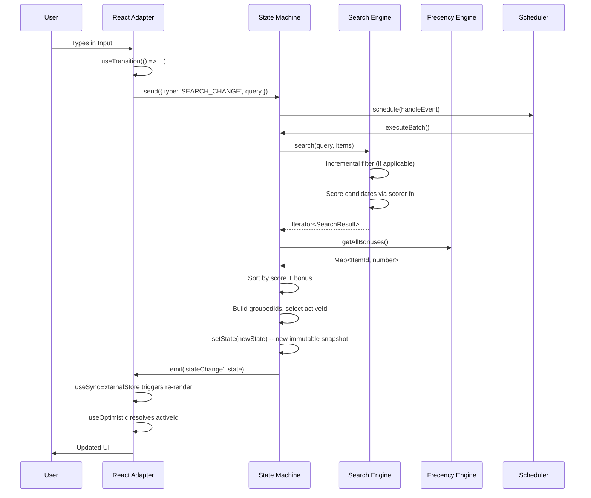

# Architecture

This document describes the technical architecture of `modern-cmdk` -- a ground-up rewrite of `cmdk` as a framework-agnostic, headless command palette engine.

---

## Table of Contents

- [Overview](#overview)
- [Layered Design](#layered-design)
- [Core Engine](#core-engine)
  - [State Machine](#state-machine)
  - [Command Registry](#command-registry)
  - [Event Emitter](#event-emitter)
  - [Scheduler](#scheduler)
- [Search Pipeline](#search-pipeline)
  - [Default Scorer](#default-scorer)
  - [Incremental Filtering](#incremental-filtering)
  - [Frecency Re-Ranking](#frecency-re-ranking)
  - [WASM Search Engine](#wasm-search-engine)
- [Keyboard System](#keyboard-system)
  - [Parser](#parser)
  - [Matcher](#matcher)
  - [Registry](#keyboard-shortcut-registry)
  - [Conflict Detection](#conflict-detection)
- [React 19 Adapter](#react-19-adapter)
  - [Store Integration](#store-integration)
  - [Compound Components](#compound-components)
  - [Concurrent Features](#concurrent-features)
- [Event Flow](#event-flow)
- [CSS Architecture](#css-architecture)
  - [GPU-Composited Animations](#gpu-composited-animations)
  - [Scroll-Driven Animations](#scroll-driven-animations)
  - [Content Visibility](#content-visibility)
  - [Accessibility Media Queries](#accessibility-media-queries)
- [Performance Budget](#performance-budget)
- [Design Decisions](#design-decisions)

---

## Overview

```
+-------------------------------------------------------------------+
|                        Application Layer                          |
+-------------------------------------------------------------------+
          |                    |                     |
+---------v-------+  +--------v--------+  +---------v---------+
| command-react   |  | (future)        |  | (future)          |
| React 19        |  | Svelte adapter  |  | Vue / Solid       |
| Compound Comps  |  |                 |  | adapters          |
+---------+-------+  +-----------------+  +-------------------+
          |
          | useSyncExternalStore
          | useTransition / useOptimistic
          |
+---------v-----------------------------------------------------+
|                    modern-cmdk                        |
|                    Framework-Agnostic Core                     |
|                                                               |
|  +-------------+  +---------------+  +---------------------+  |
|  |   State     |  |   Search      |  |   Frecency          |  |
|  |   Machine   |  |   Engine      |  |   Engine            |  |
|  |             |  |               |  |                     |  |
|  | Pure TS     |  | Pluggable     |  | Temporal API        |  |
|  | Disposable  |  | scorer fn     |  | Exponential decay   |  |
|  | Immutable   |  | Incremental   |  | Pluggable storage   |  |
|  | snapshots   |  | filtering     |  | Disposable          |  |
|  +------+------+  +-------+-------+  +----------+----------+  |
|         |                 |                      |             |
|  +------v-----------------v----------------------v----------+  |
|  |              Command Registry                            |  |
|  |  Items (Map) | Groups (Map) | Order (Array + Set)        |  |
|  |  Set.intersection | Set.difference | Set.union           |  |
|  |  Iterator Helpers | Object.groupBy | Disposable          |  |
|  +---+---------------------------------------------+-------+  |
|      |                                              |          |
|  +---v--------------------------+  +----------------v-------+  |
|  | Keyboard Shortcut Registry   |  | Scheduler              |  |
|  | Parser (RegExp.escape)       |  | rAF batching (browser) |  |
|  | Matcher (event matching)     |  | microtask (Node.js)    |  |
|  | Conflicts (Object.groupBy)   |  | Promise.withResolvers  |  |
|  | Disposable (using)           |  | Disposable             |  |
|  +------------------------------+  +------------------------+  |
+---------------------------------------------------------------+
          |
          | Optional drop-in replacement
+---------v-----------------------+
| modern-cmdk-search-wasm|
| Rust / wasm-pack                |
| Trigram index + scorer          |
| Sub-1ms on 100K items           |
+---------------------------------+
```

---

## Layered Design

The architecture follows strict layering rules:

1. **Core layer** (`modern-cmdk`) -- Pure TypeScript. No DOM APIs. No framework imports. No side effects beyond subscriber notification. Runs in Node.js, Deno, Bun, or any browser.

2. **Adapter layer** (`modern-cmdk/react`) -- Thin React 19 wrapper. Consumes the core via `useSyncExternalStore`. Renders JSX. Handles DOM events. Has `"use client"` directives.

3. **Extension layer** (`modern-cmdk-search-wasm`) -- Optional WASM search engine. Drop-in replacement for the default TypeScript scorer. Ships a Rust crate compiled with `wasm-pack`.

Dependencies flow strictly downward. The core never imports from adapters or extensions.

---

## Core Engine

### State Machine

**File:** `packages/command/src/machine.ts`

The state machine is the central coordinator. It implements the `CommandMachine` interface and the `Disposable` protocol.

```
createCommandMachine(options)
         |
         v
+------------------+
|  CommandMachine   |
|                   |
|  getState()      -+-> Returns immutable CommandState snapshot
|  send(event)     -+-> Dispatches CommandEvent through scheduler
|  subscribe(fn)   -+-> useSyncExternalStore-compatible (returns () => void)
|  subscribeState  -+-> Returns Disposable for `using` pattern
|  getRegistry()   -+-> Access the CommandRegistry
|  getKeyboard..() -+-> Access the KeyboardShortcutRegistry
|  [Symbol.dispose] +-> Cleans up all subsystems
+------------------+
```

**State shape** (`CommandState`):

| Field | Type | Description |
|---|---|---|
| `search` | `string` | Current search query |
| `activeId` | `ItemId \| null` | Currently highlighted item |
| `filteredIds` | `readonly ItemId[]` | Ordered list of visible item IDs |
| `groupedIds` | `ReadonlyMap<GroupId, readonly ItemId[]>` | Items bucketed by group |
| `filteredCount` | `number` | Total visible items |
| `loading` | `boolean` | Whether async items are loading |
| `page` | `string` | Current page name |
| `pageStack` | `readonly string[]` | Page navigation history |
| `open` | `boolean` | Dialog open state |
| `lastUpdated` | `Temporal.Instant` | Timestamp of last state change |

**Event types** (`CommandEvent`):

| Event | Payload | Effect |
|---|---|---|
| `SEARCH_CHANGE` | `query: string` | Re-filters, re-ranks, updates `activeId` |
| `ITEM_SELECT` | `id: ItemId` | Fires `onSelect`, records frecency, emits to listeners |
| `ITEM_ACTIVATE` | `id: ItemId` | Sets `activeId` if item is in filtered set |
| `NAVIGATE` | `direction: next \| prev \| first \| last` | Moves `activeId` with optional loop wrapping |
| `PAGE_PUSH` | `page: string` | Pushes current page to stack, sets new page |
| `PAGE_POP` | -- | Pops page stack |
| `OPEN` / `CLOSE` / `TOGGLE` | -- | Controls dialog visibility |
| `ITEMS_LOADED` | `items: readonly CommandItem[]` | Registers items from async source |
| `REGISTER_ITEM` | `item: CommandItem` | Registers a single item + its shortcut |
| `UNREGISTER_ITEM` | `id: ItemId` | Removes item from registry, search index, keyboard registry |
| `REGISTER_GROUP` / `UNREGISTER_GROUP` | group/id | Manages group lifecycle |

All state transitions produce a new immutable `CommandState` object. The machine never mutates state in place.

### Command Registry

**File:** `packages/command/src/registry.ts`

The registry manages item and group storage with O(1) lookup performance.

```
CommandRegistry
  |
  +-- #items: Map<ItemId, CommandItem>      -- O(1) lookup
  +-- #groups: Map<GroupId, CommandGroup>    -- O(1) lookup
  +-- #itemOrder: ItemId[]                  -- insertion order
  +-- #itemOrderSet: Set<ItemId>            -- O(1) duplicate check
  |
  +-- registerItem(item) -> Disposable      -- `using` auto-deregister
  +-- registerItems(items) -> Disposable    -- batch registration
  +-- unregisterItems(ids: Set) -> void     -- Set.difference for pruning
  +-- getItems() -> readonly CommandItem[]  -- Iterator Helpers pipeline
  +-- getGroupedItems() -> ReadonlyMap      -- Object.groupBy
  +-- intersectWith(set) -> Set             -- Set.intersection (ES2026)
  +-- differenceFrom(set) -> Set            -- Set.difference (ES2026)
  +-- unionWith(set) -> Set                 -- Set.union (ES2026)
```

ES2026 Set methods (`intersection`, `difference`, `union`) are used for efficient bulk ID operations during filtering and registration.

### Event Emitter

**File:** `packages/command/src/utils/event-emitter.ts`

A typed, GC-safe event emitter using `WeakRef` for listener storage and Iterator Helpers for pipeline operations.

Key characteristics:
- Listeners are stored as `WeakRef<Function>` -- if the consumer is garbage collected, the listener is automatically pruned on the next `emit()`.
- `.on(event, listener)` returns a `Disposable` for the `using` pattern.
- `.has(event)` and `.listenerCount(event)` use Iterator Helpers (`.some()`, `.filter().toArray().length`).
- Implements `Disposable` -- `[Symbol.dispose]()` clears all listeners.

### Scheduler

**File:** `packages/command/src/utils/scheduler.ts`

The scheduler coalesces state updates to prevent redundant re-renders:

```
Browser environment:
  schedule(update) -> pending[] -> requestAnimationFrame -> executeBatch()

Node.js / test environment:
  schedule(update) -> pending[] -> queueMicrotask -> executeBatch()
```

- Uses `Promise.withResolvers` (ES2024) for the `flush()` method.
- Uses nullish assignment (`??=`) for single-rAF coalescing: `rafId ??= requestAnimationFrame(...)`.
- Implements `Disposable` -- cancels pending rAF and clears the queue.

---

## Search Pipeline



### Default Scorer

**File:** `packages/command/src/search/default-scorer.ts`

The built-in scorer performs fuzzy matching against the item's `value` and `keywords` fields. It returns a `SearchResult` with:
- `id: ItemId` -- the matched item
- `score: number` -- relevance score (higher is better)
- `matches: ReadonlyArray<readonly [number, number]>` -- character ranges for highlighting

The scorer is pluggable -- pass a custom `filter` function to `createCommandMachine()` to replace it entirely.

### Incremental Filtering

**File:** `packages/command/src/search/index.ts`

When the user appends characters to the search query (e.g., "cop" -> "copy"), the engine only re-scores items that matched the previous query. This is tracked via:
- `previousQuery: string` -- the last query string
- `previousResults: Set<ItemId>` -- the IDs that matched

If the new query starts with the previous query, candidates are narrowed to `previousResults` before scoring. This reduces work from O(n) to O(k) where k << n.

Bulk removal uses `Set.difference` (ES2026) to efficiently prune the incremental cache.

### Frecency Re-Ranking

**File:** `packages/command/src/frecency/index.ts`

After scoring, results are optionally re-ranked by frecency bonus:

```
Final rank = search_score + frecency_bonus
```

The frecency bonus is computed using exponential decay buckets based on elapsed time since last use:

| Time Since Last Use | Weight |
|---|---|
| < 1 hour | 4.0 |
| < 1 day | 2.0 |
| < 1 week | 1.5 |
| < 1 month | 1.0 |
| Older | 0.5 |

```
frecency_bonus = frequency_count * recency_weight
```

Time elapsed is computed using `Temporal.Instant.since()` and `.total('hours')`. The `FrecencyEngine` implements `Disposable` -- on dispose, it flushes dirty data to storage (best-effort for async storage).

**Storage interface:**

```ts
interface FrecencyStorage extends Disposable {
  load(namespace: string): FrecencyData | Promise<FrecencyData>;
  save(namespace: string, data: FrecencyData): void | Promise<void>;
  [Symbol.dispose](): void;
}
```

Ships with `MemoryFrecencyStorage` (in-memory, no persistence). IndexedDB storage is provided via a separate adapter.

### WASM Search Engine

**File:** `packages/command-search-wasm/crate/src/`

The optional WASM engine provides:
- **Trigram indexing** -- pre-computes 3-character subsequences for O(1) candidate lookup
- **Rust scorer** -- native performance for fuzzy matching
- **Sub-1ms on 100K items** -- orders of magnitude faster than the TypeScript scorer at scale

The WASM engine implements the same `ScorerFn` interface and is a drop-in replacement.

---

## Keyboard System



### Parser

**File:** `packages/command/src/keyboard/parser.ts`

Parses human-readable shortcut strings into structured `ParsedShortcut` objects:

- `"Mod+K"` -- resolves `Mod` to `Meta` on macOS, `Ctrl` on Windows/Linux
- `"Ctrl+Shift+P"` -- explicit modifier specification
- `"Alt+Enter"` -- named key support
- Aliases: `Cmd`/`Command` -> `meta`, `Option`/`Opt` -> `alt`, `Control` -> `ctrl`

Uses `RegExp.escape` (ES2026) for safe pattern construction from user-provided strings.

The `normalized` field produces a deterministic modifier ordering (`meta+ctrl+shift+alt+key`) for deduplication and conflict comparison.

`formatShortcut()` renders platform-appropriate display labels (Mac symbols vs. Windows text).

### Matcher

**File:** `packages/command/src/keyboard/matcher.ts`

Compares `KeyboardEvent` properties against `ParsedShortcut` fields. All four modifier keys (`metaKey`, `ctrlKey`, `shiftKey`, `altKey`) must match exactly -- no partial matching.

### Keyboard Shortcut Registry

**File:** `packages/command/src/keyboard/index.ts`

Global shortcut management:

- `.register(shortcutStr, itemId, handler)` returns a `Disposable` -- enables `using` for automatic deregistration when the owning component unmounts.
- Attaches a single `document.addEventListener('keydown', ...)` listener.
- Safe in SSR -- checks `typeof document` before attaching.
- Implements `Disposable` -- removes the global listener and clears all bindings.

### Conflict Detection

Uses `Object.groupBy` (ES2024) to group shortcuts by normalized form:

```ts
const grouped = Object.groupBy(shortcuts, (s) => s.normalized);
// Any group with length > 1 is a conflict
```

---

## React 19 Adapter

### Store Integration



The machine's `.subscribe()` returns an unsubscribe function -- the exact signature `useSyncExternalStore` expects. No wrapper needed.

The machine's `.getState()` returns the same object reference until the next state change -- this satisfies `useSyncExternalStore`'s identity check.

### Compound Components

All components consume the machine via React context using `use(CommandContext)` (React 19):

| Component | Role | Key Props |
|---|---|---|
| `Command` | Root -- creates machine, provides context | `label`, `filter`, `loop`, `frecency` |
| `Command.Dialog` | Radix Dialog wrapper with overlay and portal | `open`, `onOpenChange` |
| `Command.Input` | Search input bound to machine state | `placeholder`, `value`, `onValueChange` |
| `Command.List` | Scrollable list with auto-virtualization and `aria-live` | `virtualize` |
| `Command.Item` | Selectable item -- registers/unregisters on mount/unmount | `value`, `onSelect`, `shortcut`, `disabled` |
| `Command.Group` | Logical group with heading | `heading` |
| `Command.Empty` | Rendered when `filteredCount === 0` | -- |
| `Command.Loading` | Rendered when `state.loading === true` | -- |
| `Command.Separator` | Visual divider | -- |
| `Command.Highlight` | Fuzzy match character highlighting | -- |
| `Command.Badge` | Status badge on items | -- |
| `Command.Shortcut` | Keyboard shortcut display (platform-aware) | -- |
| `Command.Page` | Nested page for hierarchical navigation | `id` |
| `Command.AsyncItems` | Suspense-powered async data loading | `load` |

All components:
- Have `"use client"` directives
- Accept `ref` as a prop (React 19 -- no `forwardRef`)
- Use `useId()` for stable, SSR-safe ARIA IDs

### Concurrent Features

| React 19 Feature | Usage |
|---|---|
| `useSyncExternalStore` | Subscribe to machine state without tearing |
| `useTransition` | Wrap search updates -- keeps input responsive during heavy filtering |
| `useOptimistic` | Optimistic `activeId` updates -- instant visual feedback on navigation |
| `useId` | Generate stable IDs for `aria-labelledby`, `aria-controls`, `aria-activedescendant` |
| `use()` | Consume `CommandContext` (replaces `useContext`) |
| `ref` as prop | All components accept `ref` directly -- no `forwardRef` wrapper |

---

## Event Flow

Complete cycle from user action to re-render:



---

## CSS Architecture

### GPU-Composited Animations

**File:** `packages/command-react/src/styles.css`

All animations use compositor-only properties (`opacity`, `scale`, `translate`) to avoid layout thrashing:

```
Dialog open:
  @starting-style { opacity: 0; scale: 0.96; translate: 0 8px; }
  -> opacity: 1; scale: 1; translate: 0 0;
  -> 200ms cubic-bezier(0.16, 1, 0.3, 1)
  -> display/overlay: allow-discrete

Dialog close:
  -> opacity: 0; scale: 0.96; translate: 0 4px;
  -> 150ms cubic-bezier(0.4, 0, 1, 1)

Item active:
  -> transform: translate3d(0, 0, 0)  // GPU layer promotion
  -> background-color transition 120ms
```

`@starting-style` (CSS Nesting level) enables entry animations without JavaScript -- the browser interpolates from the starting style to the final style on first render.

`display` and `overlay` transitions use `allow-discrete` for animating to/from `display: none`.

### Scroll-Driven Animations

The list uses `scroll-timeline` to drive a scroll progress indicator:

```css
[data-command-list] {
  scroll-timeline: --list-scroll block;
}

[data-command-scroll-indicator] {
  animation: scroll-progress linear;
  animation-timeline: --list-scroll;
}
```

No JavaScript scroll event listeners. Zero main-thread cost.

### Content Visibility

Virtualized items use `content-visibility: auto` with `contain-intrinsic-size`:

```css
[data-command-virtual-item] {
  content-visibility: auto;
  contain-intrinsic-size: auto 44px;
}
```

The browser skips rendering off-screen items entirely. Combined with the auto-virtualization threshold, this provides smooth scrolling even with 100K+ items.

### Accessibility Media Queries

| Media Query | Behavior |
|---|---|
| `prefers-reduced-motion: reduce` | Disables all animations and transitions |
| `prefers-contrast: more` | Thicker outlines (3px) on active/focused items |
| `forced-colors: active` | Uses system `Highlight`/`HighlightText` colors, disables `forced-color-adjust` |

CSS custom properties (`@property`) are registered for `--command-list-height` and `--command-count` with proper syntax and initial values, enabling animatable custom properties.

---

## Performance Budget

| Metric | Target | Enforcement |
|---|---|---|
| Core bundle (minified + gzipped) | ≤ 3 KB | `size-limit` in CI |
| React adapter bundle (minified + gzipped) | ≤ 5 KB | `size-limit` in CI |
| WASM search (minified + gzipped) | ≤ 50 KB | `size-limit` in CI |
| Search latency (10K items, TS scorer) | < 16 ms | Vitest bench |
| Search latency (100K items, WASM scorer) | < 1 ms | Vitest bench |
| Time to first render | < 50 ms | Playwright performance trace |
| State update cycle (send -> re-render) | < 4 ms | Vitest bench |
| Filter 10K items (incremental) | < 2 ms | Vitest bench |
| Memory per 10K items | < 5 MB | Playwright heap snapshot |
| Coverage threshold | 80% statements, branches, functions, lines | Vitest coverage in CI |

Bundle sizes are enforced on every push via the `size` CI job. Benchmarks run in a dedicated CI workflow with `pnpm bench:ci`.

---

## Design Decisions

### Why `useSyncExternalStore` over React Context for state?

React Context triggers re-renders in all consumers when any value changes. The machine exposes a single state object that changes on every event. Using context would cause every `Command.Item` to re-render on every keystroke.

`useSyncExternalStore` integrates with React's concurrent rendering pipeline. It guarantees no tearing, supports selective subscription, and the identity check on `getState()` means React can bail out of re-renders when the snapshot reference hasn't changed.

### Why a pure TypeScript core with no framework code?

1. **Testability** -- The core can be tested with Vitest in a Node.js environment, no DOM simulation needed. Tests run in milliseconds, not seconds.
2. **Portability** -- A Svelte, Vue, or Solid adapter can wrap the same core. The state machine logic is written once.
3. **Bundle efficiency** -- Users who only need the core (e.g., for a CLI tool or a non-React app) get a 3 KB package with zero dependencies.
4. **Separation of concerns** -- Framework quirks (React's batching, Svelte's reactivity) are isolated in the adapter layer.

### Why Temporal over `Date`?

- `Temporal.Instant` is immutable -- fits the immutable state model.
- `Temporal.Duration` has `.total('hours')` for precise time bucket calculation in frecency decay. No `(Date.now() - timestamp) / 3600000` arithmetic.
- `Temporal.Now.instant()` has nanosecond precision -- useful for benchmark timing.
- The frecency engine stores `Temporal.Instant` values directly. No serialization ambiguity.

### Why ES2026 target?

The project targets Node.js 25.8.0+, which ships all ES2026 features natively. Benefits:

- **Iterator Helpers** (`map`, `filter`, `toArray`, `some`, `forEach`) -- pipeline operations on Map/Set iterators without intermediate arrays.
- **Set methods** (`intersection`, `difference`, `union`) -- efficient bulk ID operations in the registry without manual loops.
- **`using` / `await using`** -- Explicit Resource Management prevents leaked listeners, timers, and storage connections. Every class implements `Disposable`.
- **`Promise.try`** -- Safe async scoring wrapper that catches synchronous exceptions.
- **`Promise.withResolvers`** -- Clean scheduler flush implementation.
- **`RegExp.escape`** -- Safe pattern construction from user-provided shortcut strings.
- **`Object.groupBy`** -- Keyboard conflict detection and item grouping.

### Why `Disposable` everywhere?

Every stateful object (machine, registry, emitter, scheduler, frecency engine, keyboard registry) implements `[Symbol.dispose]()`. This enables:

```ts
// Automatic cleanup -- no manual teardown
using machine = createCommandMachine({ ... });
// machine is disposed when the block exits

// In React components
useEffect(() => {
  const sub = machine.subscribeState(listener);
  return () => sub[Symbol.dispose]();
}, []);
```

Without `Disposable`, cleanup relies on convention. With it, the compiler and runtime enforce it.

### Why Radix UI for the React adapter dialog?

The `Command.Dialog` component wraps Radix UI's Dialog primitive for:
- Portal rendering (escapes z-index stacking contexts)
- Focus trapping and restoration
- Scroll locking
- Escape key handling
- Overlay click-to-close

Building a production-quality dialog from scratch would add significant bundle size and maintenance burden. Radix provides these behaviors in a well-tested, accessible package.

### Why Vite 8 for the playground?

The interactive playground uses **Vite 8.0.0-beta.16** with `@vitejs/plugin-react` 6.0.0-beta.0. Key benefits:

- **ES2026 build target** -- No downleveling of Iterator Helpers, Set methods, or `using` syntax.
- **Native CSS nesting** -- Vite 8 passes through CSS nesting, `@layer`, and `@starting-style` without transformation.
- **Environment API** -- Vite 8's new Environment API enables better dev/prod parity.
- **HMR warmup** -- Frequently used modules are pre-transformed for instant HMR feedback.

### Why `@starting-style` over JavaScript animations?

`@starting-style` enables CSS-only entry animations:
- Zero JavaScript execution for animation setup
- Compositor-thread only -- no main thread blocking
- Works with `display: none` transitions via `allow-discrete`
- Gracefully degrades in older browsers (no animation, but no breakage)
- Respects `prefers-reduced-motion` via a single CSS rule

JavaScript animation libraries (Framer Motion, React Spring) would add 10-30 KB to the bundle and require main-thread execution.

### Why branded types for IDs?

```ts
type ItemId = string & { readonly __brand: unique symbol };
type GroupId = string & { readonly __brand: unique symbol };
```

This prevents accidentally passing a `GroupId` where an `ItemId` is expected. The runtime cost is zero -- brands are erased by the compiler. TypeScript 6.0.1-rc's improved `unique symbol` inference makes this pattern ergonomic.

### Why `sideEffects: false`?

Declaring `sideEffects: false` in `package.json` tells bundlers (Vite, webpack, Rollup) that any module can be safely tree-shaken if its exports are unused. This is critical for the core package -- consumers who only import `createCommandMachine` should not pay for `KeyboardShortcutRegistry` or `FrecencyEngine`.

---

## File Map

```
packages/command/src/
  index.ts               -- Public API exports
  types.ts               -- Branded types, interfaces, defaults
  machine.ts             -- State machine (createCommandMachine)
  registry.ts            -- Item/group registry (Map + Set)
  search/
    types.ts             -- SearchEngine, SearchResult, ScorerFn
    index.ts             -- Search engine factory (incremental filtering)
    default-scorer.ts    -- Built-in fuzzy scorer
    fuzzy-scorer.ts      -- Async scorer (Promise.try)
  frecency/
    index.ts             -- FrecencyEngine (Temporal, Disposable)
    storage.ts           -- FrecencyStorage interface
    memory-storage.ts    -- In-memory storage implementation
  keyboard/
    parser.ts            -- Shortcut string parser (RegExp.escape)
    matcher.ts           -- KeyboardEvent matcher (Object.groupBy)
    index.ts             -- KeyboardShortcutRegistry (Disposable)
  utils/
    event-emitter.ts     -- TypedEmitter (WeakRef, Iterator Helpers)
    scheduler.ts         -- rAF/microtask batching (Promise.withResolvers)

packages/command-react/src/
  index.ts               -- Public API exports
  command.ts             -- <Command> root component
  context.ts             -- React context definitions
  dialog.ts              -- <Command.Dialog> (Radix)
  input.ts               -- <Command.Input>
  list.tsx               -- <Command.List> (virtualization, ResizeObserver)
  item.ts                -- <Command.Item> (register/unregister lifecycle)
  group.tsx              -- <Command.Group>
  empty.tsx              -- <Command.Empty>
  loading.tsx            -- <Command.Loading>
  separator.tsx          -- <Command.Separator>
  highlight.tsx          -- <Command.Highlight> (match ranges)
  badge.tsx              -- <Command.Badge>
  shortcut.tsx           -- <Command.Shortcut> (platform-aware)
  page.tsx               -- <Command.Page>
  async-items.tsx        -- <Command.AsyncItems> (Suspense)
  primitives.ts          -- Shared primitive utilities
  styles.css             -- GPU-composited animations
  hooks/
    use-command.ts       -- useCommand hook
    use-command-state.ts -- useCommandState hook
    use-register.ts      -- useRegisterItem, useRegisterGroup
    use-virtualizer.ts   -- useVirtualizer hook

packages/command-search-wasm/
  src/
    index.ts             -- TypeScript entry point
    wasm-engine.ts       -- WASM engine wrapper
  crate/
    Cargo.toml           -- Rust crate configuration
    src/
      lib.rs             -- WASM entry point
      trigram.rs          -- Trigram index implementation
      scorer.rs           -- Rust fuzzy scorer
```
