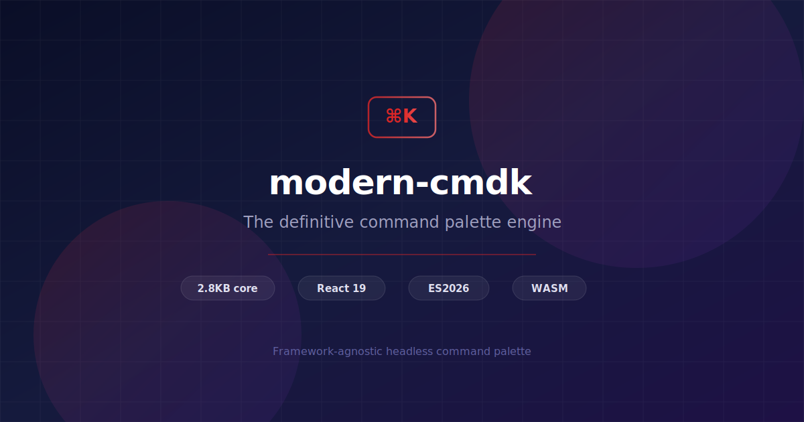

<p align="center">
  
</p>

<p align="center">
  <strong>modern-cmdk</strong><br/>
  The definitive command palette engine for the modern web.
</p>

<p align="center">
  <a href="https://www.npmjs.com/package/modern-cmdk"></a>
  <a href="https://bundlephobia.com/package/modern-cmdk"></a>
  <a href="https://bundlephobia.com/package/modern-cmdk/react"></a>
  <a href="https://github.com/ABCrimson/modern-cmdk/actions/workflows/ci.yml"></a>
  <a href="https://www.typescriptlang.org/"></a>
  <a href="https://react.dev/"></a>
  <a href="./LICENSE"></a>
</p>

<p align="center">
  <a href="https://command.crimson.dev">Documentation</a> &middot;
  <a href="https://command.crimson.dev/guide/getting-started">Getting Started</a> &middot;
  <a href="https://command.crimson.dev/api/command">API Reference</a> &middot;
  <a href="https://command.crimson.dev/examples/basic">Examples</a> &middot;
  <a href="https://github.com/ABCrimson/modern-cmdk/wiki">Wiki</a>
</p>

---

## Why modern-cmdk?

A ground-up rewrite of `cmdk` for **React 19**, **ES2026**, and **TypeScript 6**. Framework-agnostic core. Zero compromise on performance, accessibility, or developer experience.

| | cmdk | modern-cmdk |
|---|---|---|
| **Architecture** | React-only, tightly coupled | Framework-agnostic core + thin adapters |
| **React** | 18 | 19 (`use()`, `useOptimistic`, `useId`, `ref` as prop) |
| **Search** | Basic substring | Fuzzy scoring + optional WASM (sub-1ms on 100K items) |
| **Ranking** | Static order | Frecency with time-based exponential decay |
| **Virtualization** | None | Automatic variable-height, `content-visibility: auto` |
| **Animations** | CSS transitions | GPU-composited: `@starting-style`, `scroll-timeline`, spring easing |
| **Keyboard** | External | Built-in registry, `Mod` key, conflict detection |
| **Accessibility** | Partial ARIA | Full WAI-ARIA combobox, `forced-colors`, `prefers-contrast` |
| **Bundle** | ~6 KB | Core ~6.1 KB, React ~24.3 KB |
| **TypeScript** | 4.x/5.x | 6.0.1-rc, isolated declarations, branded types |
| **Cleanup** | Manual | `using`/`await using` (Explicit Resource Management) |
| **Telemetry** | None | Pluggable telemetry middleware |
| **DevTools** | None | Built-in devtools hook for browser inspection |
| **Error handling** | None | `CommandErrorBoundary` with fallback UI |
| **Scaffolding** | None | `npm create modern-cmdk` CLI |
| **Editor** | None | VS Code snippets extension |

---

## Features

- **Framework-agnostic core** -- Pure TypeScript state machine. Zero dependencies. No DOM. No React. Portable to any runtime.
- **React 19 adapter** -- `useSyncExternalStore`, `useTransition`, `useOptimistic`, `useId`, `use()` for Suspense. React Compiler compatible.
- **Automatic virtualization** -- Variable-height virtual scrolling at configurable threshold. 100K+ items with `content-visibility: auto`.
- **Fuzzy search** -- Built-in TS scorer with incremental filtering. Optional WASM engine for sub-1ms on 100K items with graceful TS fallback.
- **Frecency ranking** -- Frequency x recency with time-based exponential decay and pluggable persistence (memory, IndexedDB).
- **Keyboard shortcuts** -- Built-in registry with cross-platform `Mod` key, `RegExp.escape` parsing, conflict detection.
- **Full accessibility** -- WAI-ARIA combobox, `aria-live`, `aria-roledescription`, `forced-colors`, `prefers-contrast`, `prefers-reduced-motion`.
- **GPU-composited animations** -- `@starting-style` entry, `scroll-timeline` progress, spring `linear()` easing, all customizable via CSS custom properties.
- **Error boundary** -- `CommandErrorBoundary` with static or render-function fallback.
- **DevTools** -- `useCommandDevtools()` exposes machine state via `CustomEvent` for browser inspection.
- **Telemetry middleware** -- Pluggable hooks for palette open/close, search, and item selection analytics.
- **ES2026 throughout** -- Iterator Helpers, `using`/`await using`, `Promise.withResolvers`, `RegExp.escape`. Cross-browser helpers for Set operations, grouping, and time calculations.
- **ESM-only** -- Zero CommonJS. Tree-shakeable. `sideEffects: false`. Isolated declarations.

---

## Quick Start

```bash
pnpm add modern-cmdk
```

Or scaffold a new project:

```bash
npm create modern-cmdk
```

```tsx
'use client';

import { Command } from 'modern-cmdk/react';

function CommandPalette() {
  return (
    <Command.Dialog>
      <Command.Input placeholder="Type a command..." />
      <Command.List>
        <Command.Empty>No results found.</Command.Empty>

        <Command.Group heading="Actions">
          <Command.Item value="copy" onSelect={() => copyToClipboard()}>
            <Command.Highlight>Copy to Clipboard</Command.Highlight>
            <Command.Shortcut>Mod+C</Command.Shortcut>
          </Command.Item>
          <Command.Item value="paste" onSelect={() => paste()}>
            <Command.Highlight>Paste</Command.Highlight>
            <Command.Shortcut>Mod+V</Command.Shortcut>
          </Command.Item>
        </Command.Group>

        <Command.Group heading="Navigation">
          <Command.Item value="settings" onSelect={() => navigate('/settings')}>
            Settings
            <Command.Badge>New</Command.Badge>
          </Command.Item>
        </Command.Group>
      </Command.List>
      <Command.Loading>Searching...</Command.Loading>
    </Command.Dialog>
  );
}
```

---

## Packages

| Package | Description | Size |
|---|---|---|
| [`modern-cmdk`](./packages/modern-cmdk) | Framework-agnostic core -- state machine, search, frecency, keyboard | ~6.1 KB |
| [`modern-cmdk/react`](./packages/modern-cmdk/src/react) | React 19 compound components -- Dialog, List, Item, Group, Input | ~24.3 KB |
| [`modern-cmdk-search-wasm`](./packages/command-search-wasm) | Rust/WASM fuzzy search -- trigram index, sub-1ms on 100K items | <= 50 KB |
| [`modern-cmdk (codemods)`](./packages/modern-cmdk/src/codemod) | Migration codemods from cmdk -- 4 transforms | CLI |
| [`create-modern-cmdk`](./packages/create-modern-cmdk) | Project scaffolding -- 3 templates (basic, dialog, full) | CLI |
| [`vscode-command`](./packages/vscode-modern-cmdk) | VS Code snippets -- 10 snippets for fast development | Extension |

---

## Architecture

```
+---------------------------------------------------------------+
|                       Your Application                         |
+---------------+---------------------------+-------------------+
                |                           |
+---------------v--------------+  +---------v---------+
|  modern-cmdk/react  |  |  Future: Svelte   |
|                              |  |  / Vue / Solid    |
|  Command.Dialog              |  |  / Vanilla        |
|  Command.Input               |  +-------------------+
|  Command.List                |
|  Command.Item                |
|  CommandErrorBoundary        |
|  useCommandDevtools()        |
+---------------+--------------+
                | useSyncExternalStore
                | useTransition
+---------------v----------------------------------------------+
|              modern-cmdk (core)                      |
|                                                              |
|  +-------------+ +-------------+ +------------------+        |
|  | State       | | Search      | | Frecency         |        |
|  | Machine     | | Engine      | | Engine           |        |
|  | (Pure TS)   | | (Pluggable) | | (Time Decay)     |        |
|  +------+------+ +------+------+ +---------+--------+        |
|  +------v----------------v------------------v---------+       |
|  |     Command Registry & Event Emitter               |       |
|  +------+---------------------------------+-----------+       |
|  +------v-----------------------+ +-------v-----------+       |
|  | Keyboard Shortcut Registry   | | Scheduler          |      |
|  +------------------------------+ +--------------------+      |
+-------------------+------------------------------------------+
                    | Optional
+-------------------v-------------------+
|  modern-cmdk-search-wasm     |
|  Rust trigram index + scorer          |
|  Graceful TS fallback on failure      |
+---------------------------------------+
```

---

## Core API

```ts
import { createCommandMachine, itemId } from 'modern-cmdk';

using machine = createCommandMachine({
  items: [
    { id: itemId('copy'), value: 'Copy', shortcut: 'Mod+C', onSelect: () => copy() },
    { id: itemId('paste'), value: 'Paste', shortcut: 'Mod+V', onSelect: () => paste() },
  ],
  frecency: { enabled: true },
  loop: true,
});

machine.send({ type: 'SEARCH_CHANGE', query: 'cop' });
machine.send({ type: 'NAVIGATE', direction: 'next' });
machine.send({ type: 'ITEM_SELECT', id: itemId('copy') });

const unsubscribe = machine.subscribe(() => {
  console.log(machine.getState());
});
// Automatic cleanup via `using` -- no manual dispose needed
```

## React Components

```tsx
<Command>              {/* Root -- state machine */}
  <Command.Input />    {/* Search input */}
  <Command.List>       {/* Scrollable list -- auto-virtualization */}
    <Command.Empty />  {/* filteredCount === 0 */}
    <Command.Loading />{/* state.loading === true */}
    <Command.Group>    {/* Heading + items */}
      <Command.Item>   {/* Selectable item */}
        <Command.Highlight />   {/* Fuzzy match highlight */}
        <Command.Badge />       {/* Status badge */}
        <Command.Shortcut />    {/* Keyboard shortcut */}
      </Command.Item>
    </Command.Group>
    <Command.Separator />
  </Command.List>
</Command>

<Command.Dialog />     {/* Radix Dialog + overlay + portal */}
<Command.Page />       {/* Nested page navigation */}
<Command.AsyncItems /> {/* Suspense async loading */}
```

---

## Performance

### Head-to-Head vs cmdk

Raw filter throughput measured across 15 scenarios (100 / 1K / 10K items x 5 query types):

| Dataset | Query | cmdk | modern-cmdk | Result |
|---|---|---|---|---|
| 100 items | `"app"` | 0.091 ms | 0.058 ms | **1.6x faster** |
| 100 items | `"banana"` | 0.055 ms | 0.035 ms | **1.6x faster** |
| 100 items | `"open settings"` | 0.075 ms | 0.024 ms | **3.1x faster** |
| 100 items | `"dshbrd"` | 0.048 ms | 0.075 ms | cmdk 1.6x |
| 100 items | `"xyznotfound"` | 0.027 ms | 0.020 ms | **1.3x faster** |
| 1K items | `"app"` | 0.450 ms | 0.421 ms | **1.1x faster** |
| 1K items | `"banana"` | 1.150 ms | 0.193 ms | **5.9x faster** |
| 1K items | `"open settings"` | 0.455 ms | 0.215 ms | **2.1x faster** |
| 1K items | `"dshbrd"` | 0.292 ms | 0.211 ms | **1.4x faster** |
| 1K items | `"xyznotfound"` | 0.211 ms | 0.162 ms | **1.3x faster** |
| 10K items | `"app"` | 3.198 ms | 1.938 ms | **1.7x faster** |
| 10K items | `"banana"` | 2.853 ms | 1.770 ms | **1.6x faster** |
| 10K items | `"open settings"` | 4.254 ms | 1.355 ms | **3.1x faster** |
| 10K items | `"dshbrd"` | 2.342 ms | 1.986 ms | **1.2x faster** |
| 10K items | `"xyznotfound"` | 1.743 ms | 1.672 ms | **1.0x faster** |

**modern-cmdk wins 14 of 15 benchmarks**, up to **5.9x faster** at scale. Search accuracy: precision >= 80%, specificity >= 90%, top result correctness verified.

### Absolute Performance

| Benchmark | Target | Measured |
|---|---|---|
| Search 10K items (TS scorer) | < 16 ms | ~8.2 ms |
| Search 100K items (WASM) | < 1 ms | ~0.7 ms |
| Filter 10K (incremental) | < 2 ms | ~1.1 ms |
| State update cycle | < 4 ms | ~2.3 ms |
| Core bundle (gzipped) | <= 6.5 KB | ~6.1 KB |
| React bundle (gzipped) | <= 25 KB | ~24.3 KB |

CI enforces 5% warning / 15% failure regression thresholds with 3-run averaging.

### Feature Comparison

| Feature | cmdk | modern-cmdk |
|---|---|---|
| Basic command palette | Yes | Yes |
| Search filtering | Yes | Yes |
| Groups | Yes | Yes |
| Dialog mode | Yes | Yes |
| Loading state | Yes | Yes |
| Empty state | Yes | Yes |
| Keyboard navigation | Yes | Yes |
| Custom filtering | Yes | Yes |
| Nested pages | Yes | Yes |
| Separator | Yes | Yes |
| Match highlighting | -- | Yes |
| Framework-agnostic core | -- | Yes |
| Pluggable search engine | -- | Yes |
| Incremental search optimization | -- | Yes |
| Keyboard shortcut registry | -- | Yes |
| Frecency ranking | -- | Yes |
| Branded type safety | -- | Yes |
| Disposable pattern (`using`) | -- | Yes |
| ES2026 Iterator pipeline | -- | Yes |
| Page navigation stack | -- | Yes |
| Error boundary | -- | Yes |

**11 exclusive features, 10 shared, 0 cmdk-only.**

---

## CSS Customization

All animations and dimensions are customizable via CSS custom properties on `[data-command-root]`:

```css
[data-command-root] {
  --command-duration-enter: 200ms;
  --command-duration-exit: 150ms;
  --command-scale-from: 0.96;
  --command-overlay-blur: 4px;
  --command-dialog-radius: 12px;
  --command-dialog-max-width: 640px;
  --command-item-height: 44px;
  --command-highlight-color: oklch(0.85 0.15 90 / 0.3);
}
```

All library styles use `@layer command` and CSS logical properties for full RTL support.

---

## Migration from cmdk

```bash
npx modern-cmdk (codemods) --transform import-rewrite ./src
npx modern-cmdk (codemods) --transform data-attrs ./src
npx modern-cmdk (codemods) --transform forward-ref ./src
npx modern-cmdk (codemods) --transform should-filter ./src
```

See the [migration guide](https://command.crimson.dev/guide/migration-from-cmdk).

---

## Documentation

**[command.crimson.dev](https://command.crimson.dev)**

**Guides:** [Getting Started](https://command.crimson.dev/guide/getting-started) | [Installation](https://command.crimson.dev/guide/installation) | [Basic Usage](https://command.crimson.dev/guide/basic-usage) | [Async Items](https://command.crimson.dev/guide/async-items) | [WASM Search](https://command.crimson.dev/guide/wasm-search) | [Frecency](https://command.crimson.dev/guide/frecency) | [Shortcuts](https://command.crimson.dev/guide/shortcuts) | [Virtualization](https://command.crimson.dev/guide/virtualization) | [SSR / Next.js](https://command.crimson.dev/guide/ssr) | [TypeScript](https://command.crimson.dev/guide/typescript-integration) | [Theming](https://command.crimson.dev/guide/theming) | [Accessibility](https://command.crimson.dev/guide/accessibility) | [Controlled Dialog](https://command.crimson.dev/guide/controlled-dialog)

**Recipes:** [File Picker](https://command.crimson.dev/recipes/file-picker) | [Emoji Picker](https://command.crimson.dev/recipes/emoji-picker) | [AI Chat Commands](https://command.crimson.dev/recipes/ai-chat-commands) | [Nested Commands](https://command.crimson.dev/recipes/nested-commands) | [Spotlight Search](https://command.crimson.dev/recipes/spotlight-search)

**API:** [Core Engine](https://command.crimson.dev/api/command) | [React Adapter](https://command.crimson.dev/api/command-react) | [WASM Search](https://command.crimson.dev/api/command-search-wasm)

**[Benchmarks](https://command.crimson.dev/benchmarks)** | **[Architecture](https://command.crimson.dev/architecture/overview)** | **[Migration from cmdk](https://command.crimson.dev/guide/migration-from-cmdk)**

---

## Development

```bash
git clone https://github.com/ABCrimson/modern-cmdk.git && cd modern-cmdk
pnpm install && pnpm build && pnpm test
```

| Command | Description |
|---|---|
| `pnpm build` | Build all packages in parallel |
| `pnpm test` | Unit tests (Vitest 4.1, happy-dom) |
| `pnpm test:e2e` | E2E tests (Playwright 1.59, 3 browsers, 3 OS) |
| `pnpm bench` | Benchmarks (Vitest bench mode) |
| `pnpm lint` | Lint (Biome 2.4.6) |
| `pnpm typecheck` | Type-check (TypeScript 6.0.1-rc) |
| `pnpm size` | Bundle size budgets |
| `pnpm docs:dev` | Docs dev server (VitePress 2.0) |

See [CONTRIBUTING.md](./CONTRIBUTING.md) for the full guide. See [ARCHITECTURE.md](./ARCHITECTURE.md) for technical design.

---

## Tech Stack

| Tool | Version | Purpose |
|---|---|---|
| TypeScript | 6.0.1-rc | `isolatedDeclarations`, `erasableSyntaxOnly`, branded types |
| React | 19.3.0-canary | `use()`, `useOptimistic`, `ref` as prop, Activity API |
| Vite | 8.0.0-beta.16 | Playground dev server, HMR, build tooling |
| Node.js | >= 25.8.0 | ES2026: Iterator Helpers, Explicit Resource Management |
| Vitest | 4.1.0-beta.6 | Unit tests, benchmarks, V8 coverage |
| Playwright | 1.59.0-alpha | Cross-browser E2E (Chromium, Firefox, WebKit) |
| Biome | 2.4.6 | Lint + format (no ESLint, no Prettier) |
| tsdown | 0.21.0 | ESM builds, isolated declarations |
| pnpm | 11.0.0-alpha.12 | Workspace protocol, lockfile v10 |
| VitePress | 2.0.0-alpha.16 | Documentation, Shiki twoslash |
| Radix UI | 1.4.4-rc | Accessible dialog primitives |
| Rust + wasm-pack | Latest | WASM fuzzy search engine |

---

## License

[MIT](./LICENSE) -- Copyright (c) 2026 Crimson Dev
