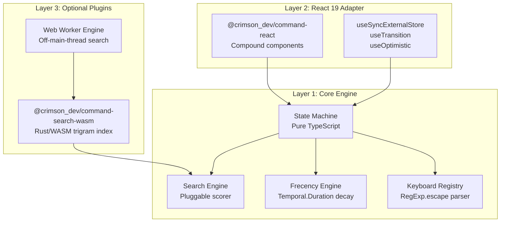
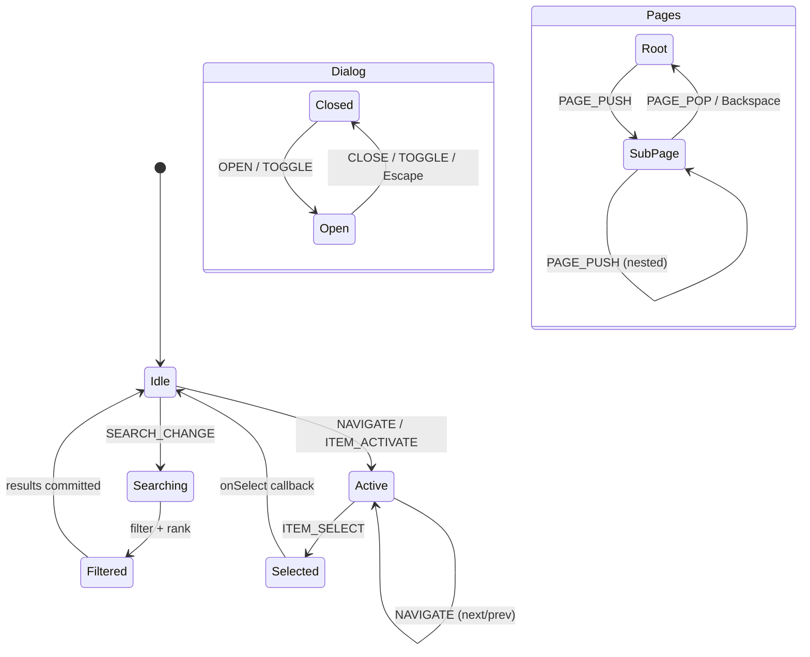
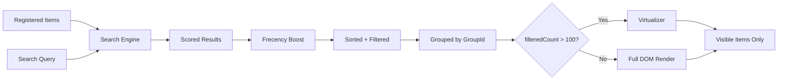
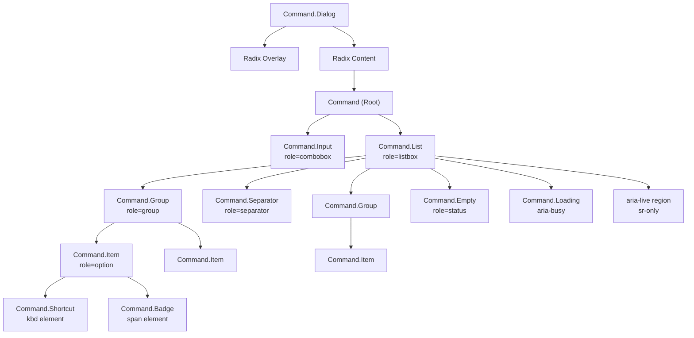
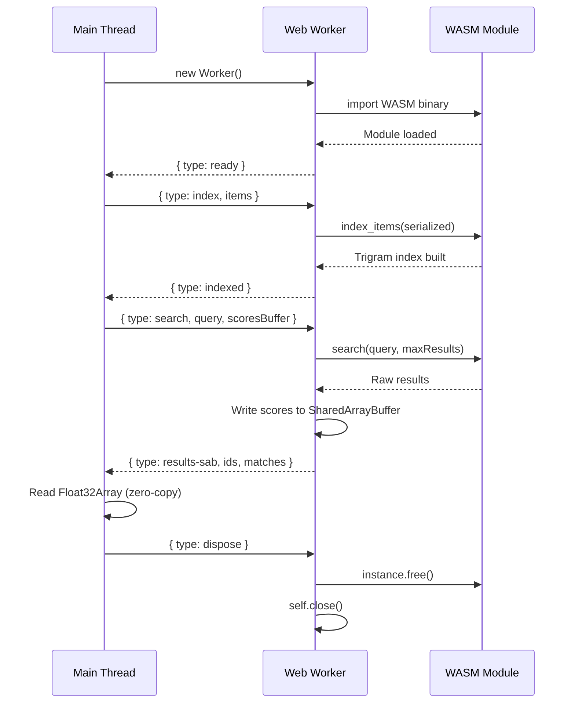

# Architecture Overview

`@crimson_dev/command` is built as a three-layer architecture: a framework-agnostic core engine, a React 19 adapter, and optional performance plugins. Each layer has a single responsibility and communicates through well-defined interfaces.

## Three-Layer Architecture



### Layer 1: Core Engine (`@crimson_dev/command`)

Pure TypeScript state machine with zero DOM dependencies. Manages:

- **Item registry** -- Registration, deregistration, grouping
- **Search and filtering** -- Pluggable `SearchEngine` interface
- **Frecency ranking** -- `Temporal.Duration` decay buckets with configurable weights
- **Keyboard shortcuts** -- `RegExp.escape`-based parser, `Object.groupBy` conflict detection
- **Navigation** -- Active item tracking, page stack, loop/no-loop
- **State snapshots** -- Immutable `CommandState` objects for efficient change detection

The core has no side effects beyond subscriber notification. It can be used with any UI framework or no framework at all.

### Layer 2: React Adapter (`@crimson_dev/command-react`)

Compound component API that bridges the core state machine to React 19:

- **`useSyncExternalStore`** -- Subscribes to machine state without tearing
- **`useTransition`** -- Wraps search updates for non-blocking rendering
- **`useOptimistic`** -- Optimistic active item updates for instant visual feedback
- **`ref` as prop** -- React 19 native ref forwarding (no `forwardRef`)
- **`"use client"` directive** -- All components are client-only
- **Radix UI integration** -- Dialog with focus trap, portal, overlay

### Layer 3: Optional Plugins

- **WASM Search** -- Rust trigram index compiled to WebAssembly for sub-1ms fuzzy search on 100K items
- **Web Worker** -- Runs WASM search off the main thread with `SharedArrayBuffer` zero-copy transfer
- **Custom storage** -- Pluggable `FrecencyStorage` implementations (memory, IndexedDB, custom)

## State Machine Flow



### Event Processing

1. External code calls `machine.send(event)`
2. The machine processes the event synchronously
3. A new immutable `CommandState` snapshot is created
4. All subscribers are notified with the new state
5. React `useSyncExternalStore` triggers a re-render with the new snapshot

## Data Flow: Items to Rendered Output



### Search Pipeline

1. **Registration** -- Items are registered via `REGISTER_ITEM` events (or React component mount)
2. **Query** -- User types in the input, triggering `SEARCH_CHANGE`
3. **Scoring** -- The search engine (TypeScript or WASM) scores each item against the query
4. **Frecency boost** -- If enabled, frecency bonuses are added to search scores
5. **Filtering** -- Items with score `0` or `false` are excluded
6. **Sorting** -- Results are sorted by final score (descending)
7. **Grouping** -- Results are partitioned into groups based on `groupId`
8. **Rendering** -- React adapter renders visible items, virtualizing if needed

## Component Tree



## WASM Worker Communication



When `SharedArrayBuffer` is available (cross-origin isolated), scores are written directly into shared memory. The main thread reads the `Float32Array` view without any data copying.

Without `SharedArrayBuffer`, results are transferred via structured clone (`postMessage`), which involves a copy but remains fast for typical result set sizes (< 100 items).

## Plugin Architecture

### Search Engine Interface

Any object implementing `SearchEngine` can replace the built-in TypeScript scorer:

```typescript
interface SearchEngine {
  index(items: readonly CommandItem[]): void;
  search(query: string, items: readonly CommandItem[]): IteratorObject<SearchResult>;
  remove(ids: ReadonlySet<ItemId>): void;
  clear(): void;
}
```

### Frecency Storage Interface

Custom storage backends implement `FrecencyStorage`:

```typescript
interface FrecencyStorage extends Disposable {
  load(namespace: string): FrecencyData | Promise<FrecencyData>;
  save(namespace: string, data: FrecencyData): void | Promise<void>;
  [Symbol.dispose](): void;
}
```

Built-in implementations:
- **`MemoryFrecencyStorage`** -- In-memory `Map`, no persistence (default)
- **`IdbFrecencyStorage`** -- IndexedDB via `idb-keyval`, persists across sessions

### Extending the Architecture

To add a custom search engine:

```typescript
import { createCommandMachine, type SearchEngine } from '@crimson_dev/command';

const myEngine: SearchEngine = {
  index(items) { /* build your index */ },
  *search(query, items) { /* yield SearchResult objects */ },
  remove(ids) { /* remove from index */ },
  clear() { /* clear index */ },
};

using machine = createCommandMachine({ search: myEngine });
```

To add a custom frecency storage:

```typescript
import { type FrecencyStorage } from '@crimson_dev/command';

class RedisFrecencyStorage implements FrecencyStorage {
  async load(namespace: string) { /* fetch from Redis */ }
  async save(namespace: string, data) { /* write to Redis */ }
  [Symbol.dispose]() { /* close connection */ }
}
```

## ES2026 Features Used

| Feature | Where Used |
|---|---|
| Iterator Helpers (`.map`, `.filter`, `.toArray`) | Search pipelines, registry operations |
| `Object.groupBy` | Shortcut conflict detection |
| `Temporal.Now.instant()` | Frecency timestamps, state `lastUpdated` |
| `Temporal.Duration` | Frecency decay bucket boundaries |
| `using` / `await using` | Machine, engine, and storage lifecycle |
| `RegExp.escape` | Shortcut string parser |
| `Promise.withResolvers()` | Worker request tracking |
| `Promise.try()` | Safe async initialization |
| Branded types (`ItemId`, `GroupId`) | Type-safe ID handling |
| `NoInfer<T>` | Callback type inference |
| `satisfies` | Default configuration validation |
