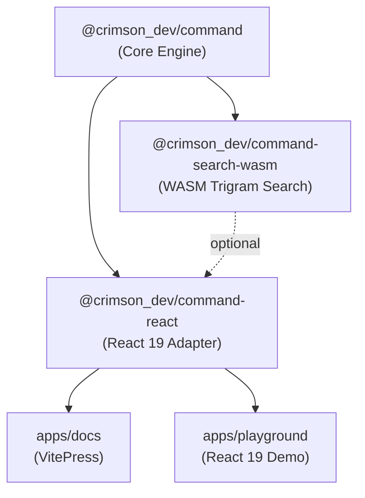
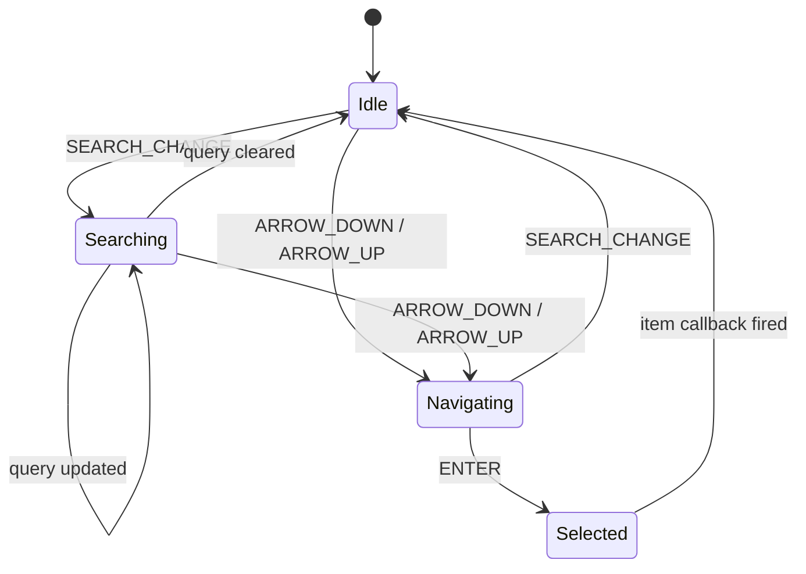
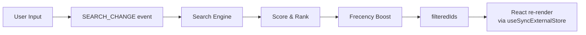
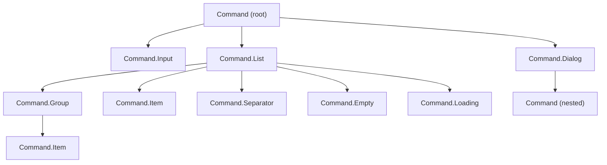
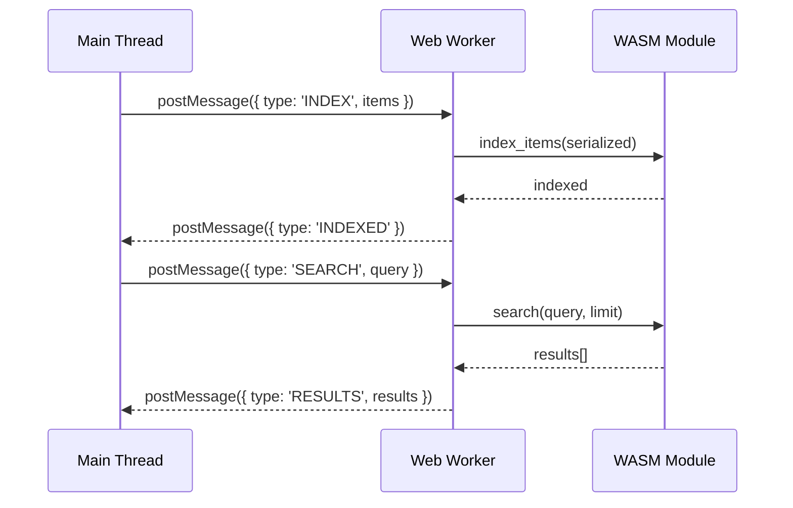

# Architecture Overview

`@crimson_dev/command` is built as a three-layer architecture: a framework-agnostic **core engine**, a **React adapter**, and an optional **WASM search** acceleration layer.

## Package Dependency Graph



## Core Engine (`@crimson_dev/command`)

The core is a **pure TypeScript state machine** with zero DOM or framework dependencies. It manages search, filtering, keyboard navigation, frecency ranking, and keyboard shortcuts.



### Key Subsystems

| Module | Responsibility |
|--------|---------------|
| `machine.ts` | State transitions, subscriber notification |
| `registry.ts` | Item/group registration with Set methods (union/intersection/difference) |
| `search/default-scorer.ts` | Fuzzy matching with Math.sumPrecise scoring |
| `search/index.ts` | Search engine factory, pluggable scorer interface |
| `frecency/index.ts` | Temporal.Duration-based decay buckets |
| `frecency/idb-storage.ts` | IndexedDB persistence via idb-keyval |
| `keyboard/parser.ts` | Shortcut string parsing with RegExp.escape |
| `keyboard/matcher.ts` | Conflict detection via Object.groupBy |
| `utils/scheduler.ts` | Microtask batching for state updates |
| `utils/event-emitter.ts` | Type-safe pub/sub with Disposable cleanup |

### Data Flow: Search Pipeline



## React Adapter (`@crimson_dev/command-react`)

The React adapter exposes 14 compound components that bind to the core state machine:



### React 19 Integration Points

- **`useSyncExternalStore`** — Subscribe to the core state machine without tearing
- **`useTransition`** — Wrap search updates for concurrent rendering
- **`useOptimistic`** — Show optimistic input values during transitions
- **`ref` as prop** — No `forwardRef` needed (React 19 native)
- **Activity API** — `CommandActivity` for keep-alive state preservation

### Virtualization

The list component auto-virtualizes when filtered items exceed a threshold. The virtualizer uses:

- `ResizeObserver` for dynamic item height measurement
- `requestIdleCallback` for deferred measurement
- `translate3d` transforms for GPU-composited positioning
- `content-visibility: auto` for off-screen rendering skip

## WASM Search (`@crimson_dev/command-search-wasm`)

Optional Rust-compiled trigram index for large datasets (10K+ items).



### Two Execution Modes

| Mode | Function | Thread | Use Case |
|------|----------|--------|----------|
| Main thread | `createWasmSearchEngine()` | Main | Simple setup, < 5K items |
| Worker thread | `createWorkerWasmSearchEngine()` | Web Worker | Large datasets, non-blocking UI |

Both implement the `SearchEngine` interface from the core package and support `AsyncDisposable` for `await using` cleanup.

## Resource Management

All engines implement `Disposable` or `AsyncDisposable` for automatic cleanup:

```typescript
// Synchronous — using
{
  using engine = createSearchEngine();
  engine.index(items);
  engine.search('query', items).toArray();
} // engine[Symbol.dispose]() called automatically

// Asynchronous — await using
{
  await using engine = await createWasmSearchEngine();
  engine.index(items);
  // ...
} // engine[Symbol.asyncDispose]() called automatically
```

## ES2026 Features Map

| Feature | Where Used |
|---------|-----------|
| Iterator Helpers | Search pipelines, registry operations, frecency bonuses |
| Set methods | Registry union/intersection/difference for group operations |
| Math.sumPrecise | Search score aggregation |
| Promise.withResolvers | Worker communication, async engine initialization |
| Promise.try | Safe async operation wrapping |
| using / await using | Engine lifecycle, subscription cleanup |
| Temporal.Now.instant() | Frecency timestamps |
| Temporal.Duration | Decay bucket boundaries |
| RegExp.escape | Keyboard shortcut parser |
| Object.groupBy | Shortcut conflict detection |
